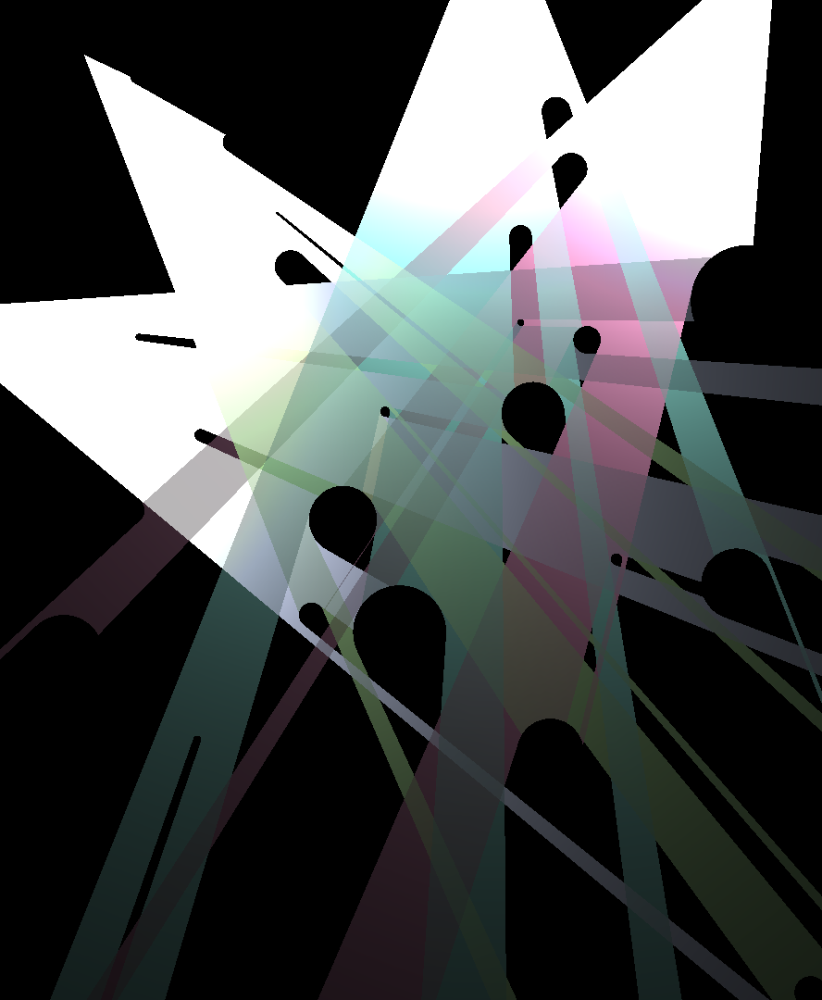

# searchlight

Experimental shadow casting visualizer.

Requires [Futhark](http://futhark-lang.org) and SDL2 and SDL2-ttf
libraries with associated header files.

## Building and running

First run `futhark pkg sync` once.

Then run `make run` to build and run in a window.

## Controls

  - Space: Pause.
  - `R`: Generate a new random configuration.

